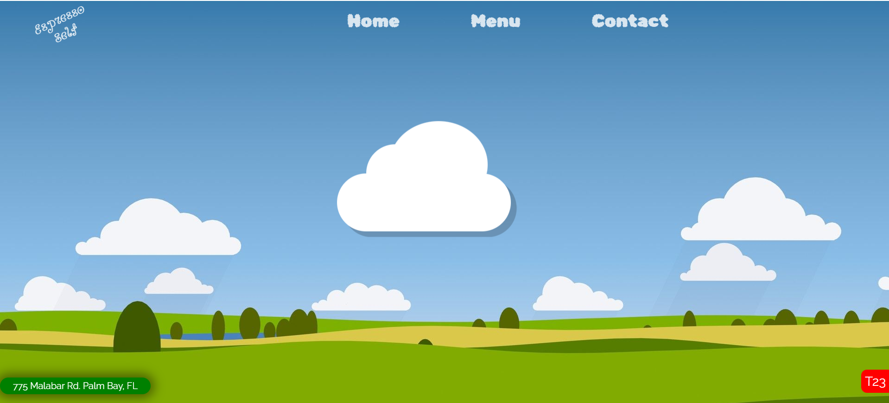
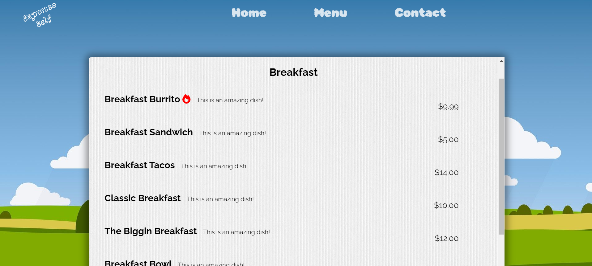
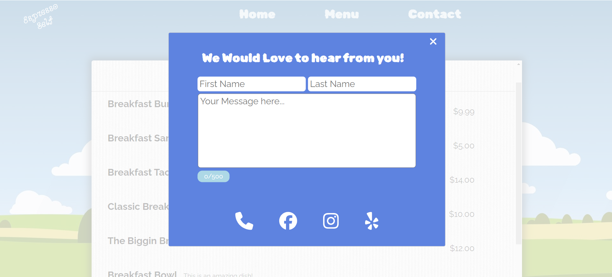

# Espresso Self

#### A small website for a mobile coffee and food truck

This website was built with React, using `create-react-app` and can be viewed [here](https://michael-montgomery.github.io/espresso/#/). Screenshots of the application in it's current state are below:

##### Homepage:

##### Menu:

##### Contact:

This website was developed in it's entirety by Michael J. Montgomery